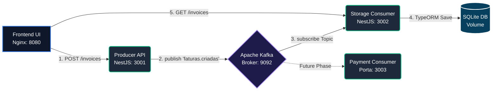

# 🏦 Event-Driven Financial System (NestJS + Kafka + Docker)


Um exemplo de arquitetura de microsserviços orientada a eventos para sistema financeiro.

## 📐 Imagem da Arquitetura do Sistema

Abaixo a representação visual de como as peças se conversam pela rede do Docker via Mensageria Distribuída:



## 🚀 Como Rodar (Tudo no Docker!)

A arquitetura inteira foi conteinerizada com `docker-compose`. **Você não precisa** ter Node.js, NPM ou bancos de dados instalados localmente.

### Passo Único
Abra o seu terminal na raiz do projeto e execute:
```bash
docker compose up -d --build
```

O Compose automaticamente irá baixar tudo, construir as imagens Node e subir **5 contêineres** em rede interna:
1. **Zookeeper** (Gerenciamento de recursos do Kafka)
2. **Kafka** (Broker de Mensagens Event-Driven)
3. **Producer** (NestJS - Microsserviço Emissor de Faturas)
4. **Consumer** (NestJS - Microsserviço de Armazenamento SQLite)
5. **Frontend** (Nginx - Servidor de Arquivos da Interface UI)

### 💻 Acessando a Aplicação
Após o comando finalizar, abra no seu navegador o endereço:
👉 **[http://localhost:8080](http://localhost:8080)**

## 🛠️ Entendendo a Mágica na Prática
O fluxo assíncrono das Etapas 1 e 2 testáveis pelo HTML:
- Você preenche o formulário no Frontend.
- O Frontend bate na API do **Producer** (Porta 3001) enviando os dados.
- O Producer formata o documento como JSON e publica a mensagem de forma rápida e assíncrona no tópico `faturas.criadas` do **Kafka**.
- Imediatamente em background, o **Consumer 1** (que está escutando na rede internamente com o grupo `storage-consumer-group`) intercepta a mensagem recém-chegada.
- O Consumer salva o registro fisicamente no repositório de banco SQLite mapeado na máquina.
- A Coluna 2 (Storage) no seu HTML faz a validação dos dados puxando do Consumer na porta 3002, exibindo a carga definitiva.