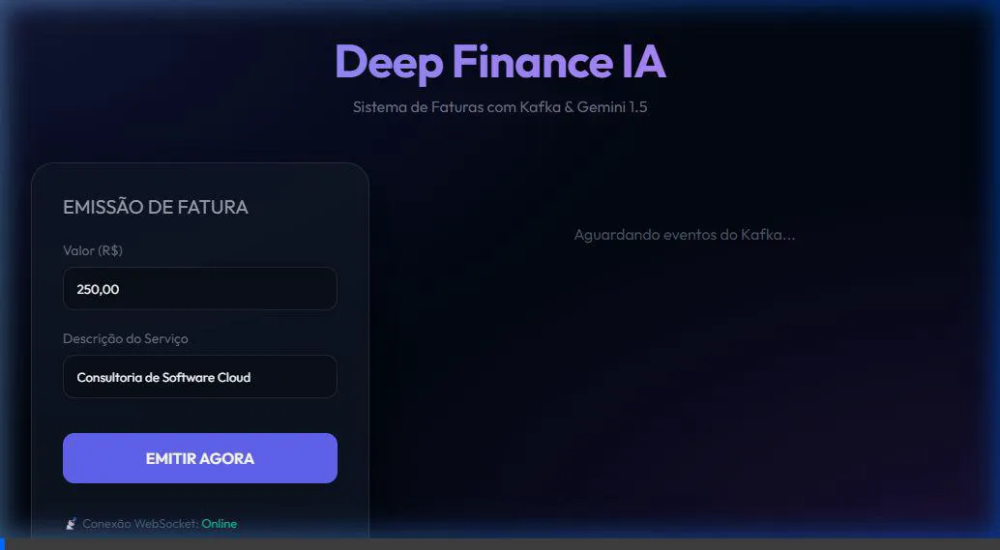
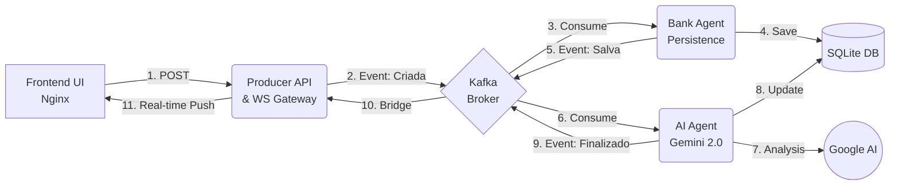

# 🏦 Deep Finance - Kafka + Gemini AI + NestJS


Um ecossistema financeiro de alto desempenho focado em **Análise de Fraude em Tempo Real** utilizando Inteligência Artificial Generativa e arquitetura orientada a eventos.

## 📺 Demonstração em Tempo Real
Veja o sistema em ação processando faturas e detectando fraudes com o Gemini 2.0:



## 📐 Arquitetura do Sistema
O projeto utiliza um fluxo de 3 agentes independentes que se comunicam via Kafka:



## 🚀 Componentes
1. **`invoice-producer`**: Gateway de entrada e ponte WebSocket (Socket.io) para o Frontend.
2. **`invoice-consumer`**: Agente Bancário responsável por persistir as faturas no banco de dados.
3. **`invoice-updater`**: Agente de IA que utiliza o **Google Gemini** para detectar fraudes e atualizar o status final.
4. **`invoice-frontend`**: Interface premium que acompanha todo o processo visualmente.

## ⚙️ Como Rodar

1. Clone o repositório.
2. Configure sua `GEMINI_API_KEY` no arquivo `.env`.
3. Suba o ambiente completo:
   ```bash
   docker-compose up --build
   ```
4. Acesse: **[http://localhost:8080](http://localhost:8080)**

## 🛡️ Segurança
As chaves de API e configurações sensíveis são gerenciadas via variáveis de ambiente (`.env`) e nunca são expostas no código fonte ou imagens Docker.